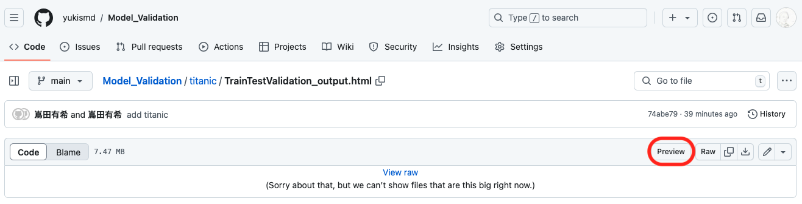

# Model Validation
モデル検証に関するトピック

- [titanic](./titanic) : テーブルデータ（回帰問題）

***
**Deepchecks**  
Github: https://github.com/deepchecks/deepchecks  
Document: https://docs.deepchecks.com/stable/getting-started/welcome.html

***
#### Deepchecksのhtmlファイルの表示方法
htmlファイルページから[Preview]を選択  
  
※ "Github Html Preview"が必要: https://chromewebstore.google.com/detail/github-html-preview/pmpjligbgooljdpakhophgddmcipglna

***
